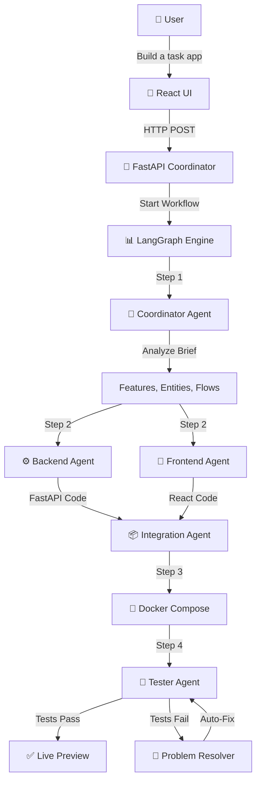
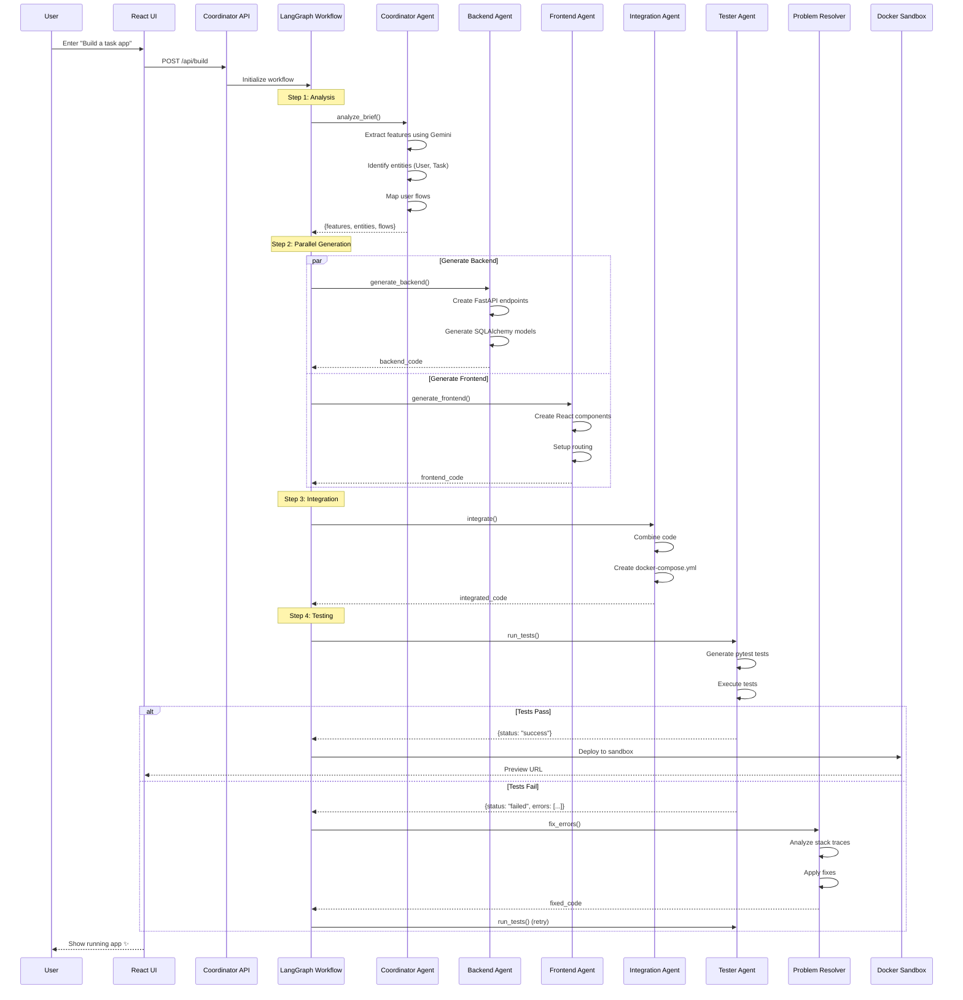

# 🎯 Interview Guide: Autonomous App-Building Platform

> **Purpose**: Complete technical reference for interview preparation  
> **Last Updated**: January 2, 2026

---

## 📋 Table of Contents

1. [Executive Summary](#-executive-summary)
2. [How the Application Works](#-how-the-application-works)
3. [System Architecture](#-system-architecture)
4. [Agent System Deep Dive](#-agent-system-deep-dive)
5. [Frameworks & Libraries](#-frameworks--libraries)
6. [Why Each Technology Was Chosen](#-why-each-technology-was-chosen)
7. [Agent Interaction Flow](#-agent-interaction-flow)
8. [Key Code Components](#-key-code-components)
9. [Interview Q&A](#-interview-qa)

---

## 🚀 Executive Summary

### What is this project?

An **AI-powered autonomous application builder** that transforms natural language project descriptions into fully functional web applications. You simply describe what you want (e.g., "Build a task management app with user authentication"), and the system:

1. **Analyzes** your requirements using AI
2. **Generates** complete frontend (React) and backend (FastAPI) code
3. **Integrates** everything with Docker
4. **Tests** the generated code
5. **Deploys** a live preview you can interact with

### The "Wow Factor"

- **Natural Language → Working App**: No coding required from the user
- **Multi-Agent Orchestration**: 23 specialized AI agents working together
- **Self-Healing**: Automatically detects and fixes build errors
- **Live Preview**: See your app running in real-time
- **Production-Ready Code**: Generates clean, maintainable code with tests

---

## 🔄 How the Application Works

### End-to-End Flow



### Step-by-Step Breakdown

| Step | Component | What Happens |
|------|-----------|--------------|
| 1️⃣ | **User Input** | User enters a project description in the UI |
| 2️⃣ | **API Request** | POST to `/api/build` with the project brief |
| 3️⃣ | **Coordinator Analysis** | AI extracts features, entities, and user flows |
| 4️⃣ | **Parallel Generation** | Backend + Frontend agents generate code simultaneously |
| 5️⃣ | **Integration** | Code is combined and Docker Compose is generated |
| 6️⃣ | **Testing** | Automated tests are generated and executed |
| 7️⃣ | **Problem Resolution** | Any errors are auto-detected and fixed |
| 8️⃣ | **Deployment** | App is deployed to a Docker sandbox |
| 9️⃣ | **Preview** | User gets a live URL to their running application |

---

## 🏗️ System Architecture

### High-Level Architecture

```
┌─────────────────────────────────────────────────────────────────┐
│                        PRESENTATION LAYER                        │
│  ┌─────────────────────────────────────────────────────────────┐ │
│  │                    React + Vite UI                          │ │
│  │    - Build Dashboard    - Code Editor    - Live Preview     │ │
│  └─────────────────────────────────────────────────────────────┘ │
├─────────────────────────────────────────────────────────────────┤
│                          API LAYER                               │
│  ┌─────────────────────────────────────────────────────────────┐ │
│  │                   FastAPI Coordinator                        │ │
│  │    - 50+ REST Endpoints  - WebSocket Updates  - Auth        │ │
│  └─────────────────────────────────────────────────────────────┘ │
├─────────────────────────────────────────────────────────────────┤
│                     ORCHESTRATION LAYER                          │
│  ┌─────────────────────────────────────────────────────────────┐ │
│  │                  LangGraph Workflow Engine                   │ │
│  │    - State Management   - Step Execution   - Error Recovery │ │
│  └─────────────────────────────────────────────────────────────┘ │
├─────────────────────────────────────────────────────────────────┤
│                        AGENT LAYER                               │
│  ┌──────────────┐ ┌──────────────┐ ┌──────────────────────────┐ │
│  │ Coordinator  │ │   Backend    │ │        Frontend          │ │
│  │    Agent     │ │    Agent     │ │         Agent            │ │
│  └──────────────┘ └──────────────┘ └──────────────────────────┘ │
│  ┌──────────────┐ ┌──────────────┐ ┌──────────────────────────┐ │
│  │ Integration  │ │   Tester     │ │   Problem Resolver       │ │
│  │    Agent     │ │    Agent     │ │        Agent             │ │
│  └──────────────┘ └──────────────┘ └──────────────────────────┘ │
├─────────────────────────────────────────────────────────────────┤
│                     INFRASTRUCTURE LAYER                         │
│  ┌──────────────┐ ┌──────────────┐ ┌──────────────────────────┐ │
│  │    Docker    │ │  PostgreSQL  │ │    File System (.state)  │ │
│  │   Sandbox    │ │   Database   │ │     Build Registry       │ │
│  └──────────────┘ └──────────────┘ └──────────────────────────┘ │
└─────────────────────────────────────────────────────────────────┘
```

### Directory Structure

```
Software builder/
├── coordinator/              # 🔧 Main orchestration layer
│   ├── agents/              # Coordinator-specific agents
│   ├── services/            # Core services (12 services)
│   │   ├── sandbox_orchestrator.py   # Docker container management
│   │   ├── repository_detector.py    # Auto-detect project type
│   │   ├── session_manager.py        # User sessions
│   │   └── agent_collaboration_manager.py
│   ├── workflows/           # LangGraph workflow definitions
│   ├── ui/                  # React-based web interface
│   └── main.py             # Entry point (2865 lines)
│
├── agents/                  # 🤖 23 Specialized AI agents
│   ├── base_agent.py       # Abstract base class for all agents
│   ├── coordinator_agent.py # Brief analysis & task planning
│   ├── frontend_agent.py   # React component generation
│   ├── backend_agent.py    # FastAPI & SQLAlchemy generation
│   ├── integration_agent.py # System integration
│   ├── tester_agent.py     # Test generation & execution
│   ├── problem_resolver_agent.py     # Error detection
│   ├── enhanced_problem_resolver.py  # Auto-fixing
│   ├── documentation_agent.py        # Docs generation
│   ├── security_agent.py             # Security analysis
│   ├── deployment_agent.py           # Docker & CI/CD
│   ├── autogen_collaboration.py      # Agent dialogue
│   └── semantic_kernel_integration.py # Tool management
│
├── workflows/               # 📊 LangGraph workflows
│   ├── app_builder_fixed.py # Main build workflow
│   ├── app_builder_enhanced.py
│   └── app_builder_phase2.py
│
├── services/                # 🛠️ Shared services (26 services)
│   ├── framework_registry.py        # Framework selection
│   ├── template_library.py          # Code templates
│   ├── build_registry.py            # Build tracking
│   ├── error_feedback_system.py     # Error analysis
│   └── metrics_collector.py         # Performance metrics
│
├── generated/               # 📂 Generated applications output
│   └── [project-name]/
│       ├── backend/        # Generated FastAPI code
│       ├── frontend/       # Generated React code
│       └── docker-compose.yml
│
└── config/                  # ⚙️ Configuration
    └── settings.py         # System settings
```

---

## 🤖 Agent System Deep Dive

### The 23 Specialized Agents

Our platform uses **23 specialized AI agents** organized in a hierarchy:

#### Layer 1: Coordination

| Agent | Purpose | Key Responsibilities |
|-------|---------|---------------------|
| **CoordinatorAgent** | Master orchestrator | Analyzes briefs, extracts features/entities, plans tasks |

#### Layer 2: Code Generation

| Agent | Purpose | Output |
|-------|---------|--------|
| **BackendAgent** | API generation | FastAPI endpoints, SQLAlchemy models, auth logic |
| **FrontendAgent** | UI generation | React components, views, forms, API integration |

#### Layer 3: Integration & Quality

| Agent | Purpose | Output |
|-------|---------|--------|
| **IntegrationAgent** | Combine code | Docker Compose, environment setup |
| **TesterAgent** | Test generation | Unit tests, integration tests, coverage |
| **QualityAssuranceAgent** | Code review | Best practices, lint checks |
| **CodeReviewAgent** | Deep review | Security issues, performance problems |

#### Layer 4: Problem Resolution

| Agent | Purpose | Features |
|-------|---------|----------|
| **ProblemResolverAgent** | Error detection | Stack trace analysis, error categorization |
| **EnhancedProblemResolver** | Auto-fixing | Automatic fixes, learning from past fixes |

#### Layer 5: Advanced Features

| Agent | Purpose | Output |
|-------|---------|--------|
| **DocumentationAgent** | Docs generation | API docs, README, architecture |
| **SecurityAgent** | Security scan | Vulnerability detection, SQL injection checks |
| **DeploymentAgent** | Deployment | Dockerfiles, CI/CD pipelines |
| **OptimizationAgent** | Performance | Code optimization suggestions |
| **DependencyAgent** | Dependency mgmt | Package updates, conflict resolution |
| **MonitoringAgent** | Observability | Metrics, logging setup |
| **CICDGeneratorAgent** | Pipelines | GitHub Actions, GitLab CI |

### How Agents Communicate

Agents communicate via **structured JSON messages**:

```python
{
    "task_id": "uuid-1234-5678",
    "agent": "backend",
    "action": "generate_api",
    "inputs": {
        "entities": [{"name": "Task", "fields": {...}}],
        "endpoints": ["create", "read", "update", "delete"]
    },
    "outputs": {
        "files": {
            "main.py": "...",
            "models/task.py": "..."
        },
        "status": "success"
    }
}
```

### BaseAgent Architecture

All agents inherit from `BaseAgent` which provides:

```python
class BaseAgent(ABC):
    """Base class for all agents"""
    
    # Core execution method (must implement)
    @abstractmethod
    async def execute(self, context: ExecutionContext) -> ExecutionResult
    
    # Safe execution with error handling & telemetry
    async def execute_safe(self, context: ExecutionContext) -> ExecutionResult
    
    # Agent status tracking
    def get_status(self) -> AgentStatus  # IDLE, RUNNING, COMPLETED, FAILED
    
    # Performance metrics
    def get_metrics(self) -> dict  # Execution count, success rate, avg duration
    
    # Capabilities declaration
    def get_capabilities(self) -> List[AgentCapability]
```

---

## 📚 Frameworks & Libraries

### Core Technologies

| Technology | Category | Version | Purpose |
|------------|----------|---------|---------|
| **Google Gemini** | LLM | latest | AI brain for all agents |
| **LangGraph** | Orchestration | ≥0.0.20 | Workflow state management |
| **LangChain** | LLM Framework | ≥1.0.0 | Prompt management, chains |
| **AutoGen** | Multi-agent | ≥0.2.0 | Agent collaboration |
| **Semantic Kernel** | Tool mgmt | ≥0.9.0 | Skill invocation |

### Backend Stack (Generated Apps)

| Technology | Purpose | Why It's Generated |
|------------|---------|-------------------|
| **FastAPI** | Web framework | REST API endpoints |
| **SQLAlchemy** | ORM | Database models & queries |
| **PostgreSQL** | Database | Data persistence |
| **Pydantic** | Validation | Request/response schemas |
| **Alembic** | Migrations | Database version control |

### Frontend Stack (Generated Apps)

| Technology | Purpose | Why It's Generated |
|------------|---------|-------------------|
| **React** | UI library | Component-based UI |
| **Vite** | Build tool | Fast HMR, bundling |
| **TailwindCSS** | Styling | Utility-first CSS |
| **React Router** | Navigation | Client-side routing |

### Infrastructure & DevOps

| Technology | Purpose |
|------------|---------|
| **Docker** | Containerization |
| **Docker Compose** | Multi-container orchestration |
| **Prometheus** | Metrics collection |
| **psutil** | Process management |

### Testing & Quality

| Technology | Purpose |
|------------|---------|
| **pytest** | Python testing |
| **Jest** | JavaScript testing |
| **black/isort** | Code formatting |
| **bandit** | Security scanning |
| **pylint/mypy** | Code quality |

---

## ❓ Why Each Technology Was Chosen

### 🧠 Why Google Gemini?

**Chosen over**: OpenAI GPT-4, Claude, Llama

**Reasons**:
- ✅ **Cost-effective**: Competitive pricing for high-volume usage
- ✅ **Large context window**: Handles large codebases
- ✅ **Strong coding abilities**: Excellent at Python/JavaScript generation
- ✅ **LangChain integration**: First-class `langchain-google-genai` support
- ✅ **Multimodal**: Can understand images (future: UI mockup → code)

### 📊 Why LangGraph?

**Chosen over**: Raw async/await, Celery, Airflow

**Reasons**:
- ✅ **State management**: Automatic state persistence and recovery
- ✅ **Graph-based workflows**: Visual, declarative workflow definition
- ✅ **Checkpoint support**: Resume workflows from any point
- ✅ **Conditional branching**: Easy error handling and retries
- ✅ **LangChain ecosystem**: Native integration with LangChain

```python
# Example: LangGraph workflow state
class AppBuilderState(TypedDict):
    build_id: str
    brief: str
    features: list[dict]     # Extracted by coordinator
    backend_code: dict       # Generated by backend agent
    frontend_code: dict      # Generated by frontend agent
    build_status: str        # "building" | "success" | "failed"
    errors: list[str]
```

### 🤝 Why AutoGen?

**Chosen over**: Custom messaging, RabbitMQ, custom protocols

**Reasons**:
- ✅ **Multi-agent dialogue**: Built-in conversation patterns
- ✅ **Clarification support**: Agents can ask questions
- ✅ **Conflict resolution**: Structured disagreement handling
- ✅ **Round-robin discussions**: Multiple agents can debate

### 🛠️ Why Semantic Kernel?

**Chosen over**: LangChain Tools alone, custom tool system

**Reasons**:
- ✅ **Plugin architecture**: Modular skill registration
- ✅ **Skill chaining**: Execute multiple tools in sequence
- ✅ **Dynamic invocation**: Add new capabilities at runtime
- ✅ **Type safety**: Strong parameter validation

```python
# Example: Registering a skill
kernel_manager.register_skill(
    "validate_code",
    "Validate code syntax and structure",
    validate_code_function,
    {"code": "string", "language": "string"}
)
```

### ⚡ Why FastAPI (for generated apps)?

**Chosen over**: Flask, Django, Express

**Reasons**:
- ✅ **Automatic docs**: OpenAPI/Swagger out of the box
- ✅ **Type hints**: Pydantic validation = fewer bugs
- ✅ **Async natives**: Built for async/await
- ✅ **Performance**: One of the fastest Python frameworks
- ✅ **Modern**: Matches modern Python development practices

### ⚛️ Why React + Vite (for generated apps)?

**Chosen over**: Next.js, Vue, Angular

**Reasons**:
- ✅ **Developer familiarity**: Most popular frontend framework
- ✅ **Component model**: Perfect for AI to generate modular pieces
- ✅ **Vite speed**: Instant HMR for development
- ✅ **TailwindCSS**: AI can easily generate utility classes
- ✅ **No SSR complexity**: Simpler to generate and test

---

## 🔗 Agent Interaction Flow

### Detailed Sequence Diagram



### The AutoGen Collaboration Pattern

When agents need to discuss or clarify:

```python
# Agent asking for clarification
await collaboration_manager.request_clarification(
    requester="backend",
    question="Should User have email or username for login?",
    context={"entities": [...], "brief": "..."}
)

# Multi-agent discussion
await collaboration_manager.collaborative_discussion(
    topic="Database schema design",
    participants=["backend", "frontend", "integration"],
    rounds=3  # 3 rounds of discussion
)
```

---

## 🔧 Key Code Components

### 1. The Workflow Engine (`workflows/app_builder_fixed.py`)

```python
class AppBuilderWorkflowFixed:
    """Main workflow orchestrator"""
    
    async def build_from_brief(
        self,
        description: str,
        name: str = None,
        requirements: list[str] = None
    ) -> dict:
        # 1. Create unique build ID
        build_id = str(uuid.uuid4())
        
        # 2. Initialize workflow state
        state = AppBuilderState(
            build_id=build_id,
            brief=description,
            project_name=sanitize_name(name or description)
        )
        
        # 3. Run coordinator analysis
        analysis = await self.coordinator_agent.analyze_brief(description)
        state.features = analysis["features"]
        state.entities = analysis["entities"]
        
        # 4. Parallel code generation
        backend_code = await self.backend_agent.generate(state)
        frontend_code = await self.frontend_agent.generate(state)
        
        # 5. Integration
        integrated = await self.integration_agent.integrate(
            backend_code, frontend_code
        )
        
        # 6. Write to disk
        self._persist_to_disk(build_id, integrated)
        
        return {
            "build_id": build_id,
            "status": "success",
            "app_url": f"http://localhost:3000",
            "source_path": f"./generated/{state.project_name}"
        }
```

### 2. The Coordinator Agent (`agents/coordinator_agent.py`)

```python
class CoordinatorAgent:
    """Analyzes project briefs"""
    
    async def analyze_brief(self, brief: str) -> dict:
        prompt = f"""Analyze this project brief and extract:
        1. Features (list of functionalities)
        2. Entities (data models needed)
        3. User Flows (step-by-step user journeys)
        
        Brief: {brief}
        
        Return as JSON with keys: features, entities, user_flows
        """
        
        response = await self.llm.invoke(prompt)
        return json.loads(response.content)
```

### 3. The Base Agent Pattern (`agents/base_agent.py`)

```python
class BaseAgent(ABC):
    """Base class all agents inherit from"""
    
    def __init__(self, llm, settings):
        self.llm = llm
        self.settings = settings
        self.status = AgentStatus.IDLE
        self.execution_history = []
    
    @abstractmethod
    async def execute(self, context: ExecutionContext) -> ExecutionResult:
        """Main execution - must be implemented"""
        pass
    
    async def execute_safe(self, context: ExecutionContext) -> ExecutionResult:
        """Wrapped execution with error handling"""
        self.status = AgentStatus.RUNNING
        start_time = time.time()
        
        try:
            result = await self.execute(context)
            self.status = AgentStatus.COMPLETED
            return result
        except Exception as e:
            self.status = AgentStatus.FAILED
            return ExecutionResult(
                status=AgentStatus.FAILED,
                output=None,
                errors=[str(e)]
            )
        finally:
            # Record metrics
            duration = time.time() - start_time
            self.execution_history.append({
                "duration": duration,
                "status": self.status
            })
```

### 4. The Sandbox Orchestrator (`coordinator/services/sandbox_orchestrator.py`)

```python
class SandboxOrchestrator:
    """Manages Docker containers for app preview"""
    
    async def launch_instance(
        self,
        app_path: str,
        port: int = 3000,
        cpu_limit: float = 1.0,
        memory_limit: str = "512m"
    ) -> dict:
        # Create Docker container
        container = self.docker_client.containers.run(
            image="node:18",
            command="npm start",
            ports={f"{port}/tcp": port},
            volumes={app_path: "/app"},
            cpus=cpu_limit,
            mem_limit=memory_limit,
            detach=True
        )
        
        return {
            "container_id": container.id,
            "preview_url": f"http://localhost:{port}",
            "status": "running"
        }
```

---

## 💬 Interview Q&A

### 1. "What problem does this solve?"

> "This platform eliminates the gap between having an idea and having a working application. Non-technical users can describe what they want in plain English, and the system generates production-ready code. For developers, it accelerates prototyping from days to minutes."

### 2. "Why use multiple agents instead of one big LLM call?"

> "Specialization leads to better results. Each agent is an expert in its domain:
> - The **Backend Agent** knows FastAPI patterns and SQLAlchemy best practices
> - The **Frontend Agent** understands React component architecture
> - The **Problem Resolver** specializes in error diagnosis
> 
> This also allows **parallel execution** - backend and frontend generate simultaneously, cutting build time in half."

### 3. "How do agents communicate?"

> "Agents communicate through a central **Workflow State** managed by LangGraph. Each agent reads the current state, performs its task, and updates the state. For real-time discussions, we use **AutoGen's collaboration patterns** where agents can request clarifications or participate in multi-round discussions."

### 4. "What happens when the generated code has errors?"

> "We have a **self-healing loop**:
> 1. The Tester Agent runs tests and detects failures
> 2. The Problem Resolver Agent analyzes stack traces
> 3. It generates and applies fixes automatically
> 4. Tests are re-run
> 5. This continues until tests pass or a max attempt limit is reached
> 
> The Enhanced Problem Resolver even **learns from past fixes** to improve over time."

### 5. "Why LangGraph over other workflow tools?"

> "LangGraph was chosen for three key reasons:
> 1. **State Persistence**: It automatically checkpoints state, so workflows can resume after failures
> 2. **LangChain Integration**: Perfect fit with our LLM stack
> 3. **Graph-Based Design**: Workflows are visual and easy to reason about - we can see exactly which step we're on and what comes next"

### 6. "How do you ensure code quality?"

> "Multiple layers:
> 1. **Code Review Agent**: Reviews generated code for best practices
> 2. **Security Agent**: Scans for vulnerabilities (SQL injection, XSS)
> 3. **Quality Assurance Agent**: Enforces coding standards
> 4. **Automated Testing**: Every build includes generated tests
> 5. **Linting**: All code passes through black, isort, and pylint"

### 7. "What makes this different from GitHub Copilot?"

> "Copilot is a **code completion** tool - it helps you write code faster. This platform is an **application builder** - you give it requirements and get a complete, running application. It handles:
> - Architecture decisions
> - File structure
> - Database schema
> - API design
> - Frontend-backend integration
> - Testing
> - Deployment
> 
> It's the difference between having a typing assistant and having a full development team."

### 8. "How scalable is this?"

> "The system is designed for scalability:
> - **Stateless API**: Coordinator can be horizontally scaled
> - **Docker Sandboxes**: Each preview runs in isolation
> - **Async Architecture**: FastAPI + async agents handle concurrent builds
> - **Build Registry**: Persistent storage tracks all builds
> 
> We use Prometheus metrics to monitor performance and identify bottlenecks."

### 9. "What's the tech stack?"

> "**Backend**: Python, FastAPI, LangGraph, LangChain, Google Gemini, SQLAlchemy  
> **Frontend**: React, Vite, TypeScript, TailwindCSS  
> **Infrastructure**: Docker, Docker Compose, PostgreSQL  
> **AI Frameworks**: AutoGen (multi-agent), Semantic Kernel (tool management)  
> **Testing**: pytest, Jest, bandit, pylint"

### 10. "What would you improve?"

> "Three areas:
> 1. **More frameworks**: Currently generates React/FastAPI, could add Vue/Django/Express
> 2. **UI from mockups**: Use Gemini's multimodal capabilities to generate UI from wireframes
> 3. **Deployment targets**: Auto-deploy to Vercel/Railway/AWS instead of just local Docker"

---

## 📊 Quick Reference Card

### API Endpoints

| Endpoint | Method | Purpose |
|----------|--------|---------|
| `/api/build` | POST | Create new app from brief |
| `/api/build/{id}/status` | GET | Get build progress |
| `/api/builds` | GET | List all builds |
| `/api/sandbox/launch` | POST | Start preview container |
| `/api/agent/problem-resolver` | POST | Diagnose/fix errors |
| `/api/test/run` | POST | Execute tests |

### Agent Capabilities

| Agent | Capability Enum |
|-------|-----------------|
| CoordinatorAgent | `COORDINATION` |
| BackendAgent | `CODE_GENERATION` |
| FrontendAgent | `CODE_GENERATION` |
| TesterAgent | `TESTING` |
| IntegrationAgent | `INTEGRATION` |
| ProblemResolverAgent | `PROBLEM_RESOLUTION` |
| CodeReviewAgent | `CODE_ANALYSIS` |

### Run the App

```bash
# Start coordinator (backend)
python coordinator/main.py

# Start UI (frontend)
cd coordinator/ui && npm run dev

# Access
# UI: http://localhost:5173
# API: http://localhost:5000
```

---

## 🎯 Key Takeaways for the Interview

1. **Multi-Agent Architecture**: 23 specialized agents, not one monolithic LLM
2. **LangGraph for State**: Checkpointed, recoverable workflows
3. **AutoGen for Dialogue**: Agents can discuss and clarify
4. **Semantic Kernel for Tools**: Modular, pluggable skills
5. **Self-Healing**: Automatic error detection and fixing
6. **Production-Ready Output**: Docker, tests, docs all generated

Good luck with your interview! 🍀
