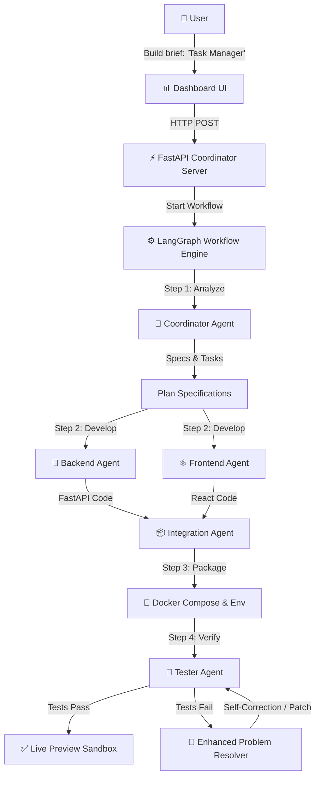

# Autonomous App-Building Platform

An AI-driven development system that transforms natural-language project briefs into fully functional web applications. The system coordinates 23+ specialized AI agents to generate React frontends, FastAPI backends, PostgreSQL schemas, and Docker configurations, complete with live preview sandboxing, automated testing, and self-correcting error resolution.

> [!CAUTION]
> **RESTRICTED USE**: This repository is submitted for **interview evaluation purposes only**. Unauthorized copying, commercial use, or deployment of this code without the author's explicit written permission is strictly prohibited.

---

## 🏗️ System Architecture

The platform uses a modular, multi-agent architecture orchestrated by LangGraph, incorporating AutoGen dialogues for agent collaboration and Semantic Kernel for dynamic tool invocation:



### Flow of Execution:
1.  **Analyze Brief**: The [Coordinator Agent](file:///c:/Users/Lenovo/Code/Software%20builder/agents/coordinator_agent.py) parses the user prompt, extracting key features, data models (entities), and user journeys.
2.  **Parallel Code Generation**: The [Backend Agent](file:///c:/Users/Lenovo/Code/Software%20builder/agents/backend_agent.py) and [Frontend Agent](file:///c:/Users/Lenovo/Code/Software%20builder/agents/frontend_agent.py) generate their respective application modules in parallel.
3.  **App Packaging & Integration**: The [Integration Agent](file:///c:/Users/Lenovo/Code/Software%20builder/agents/integration_agent.py) builds the unified directory structure, configures the environment file (`.env.example`), and drafts the docker configurations.
4.  **Automated CI/CD Validation**: The [Tester Agent](file:///c:/Users/Lenovo/Code/Software%20builder/agents/tester_agent.py) runs linters, security scans, and test suites.
5.  **Self-Correction**: If any errors are found, the [Enhanced Problem Resolver](file:///c:/Users/Lenovo/Code/Software%20builder/agents/enhanced_problem_resolver.py) reads the logs and patches the files automatically.
6.  **Preview Orchestration**: The [Live Preview Service](file:///c:/Users/Lenovo/Code/Software%20builder/services/live_preview_service.py) starts up container services, establishing a sandbox for runtime evaluation.

---

## 🤖 Directory of Specialized Agents

All agents inherit from the `BaseAgent` class defined in [base_agent.py](file:///c:/Users/Lenovo/Code/Software%20builder/agents/base_agent.py):

| Agent | Source File | Responsibility |
| :--- | :--- | :--- |
| **Coordinator Agent** | [coordinator_agent.py](file:///c:/Users/Lenovo/Code/Software%20builder/agents/coordinator_agent.py) | Analyzes input briefs, maps database entities, and schedules tasks. |
| **Backend Agent** | [backend_agent.py](file:///c:/Users/Lenovo/Code/Software%20builder/agents/backend_agent.py) | Synthesizes FastAPI routing, SQLAlchemy schemas, models, and tests. |
| **Frontend Agent** | [frontend_agent.py](file:///c:/Users/Lenovo/Code/Software%20builder/agents/frontend_agent.py) | Builds React + Vite views, Tailwind CSS styles, and API clients. |
| **Integration Agent** | [integration_agent.py](file:///c:/Users/Lenovo/Code/Software%20builder/agents/integration_agent.py) | Aggregates code, creates Docker Compose YAMLs, and generates READMEs. |
| **Tester Agent** | [tester_agent.py](file:///c:/Users/Lenovo/Code/Software%20builder/agents/tester_agent.py) | Generates and executes target test suites on generated modules. |
| **Enhanced Problem Resolver** | [enhanced_problem_resolver.py](file:///c:/Users/Lenovo/Code/Software%20builder/agents/enhanced_problem_resolver.py) | Parses output exceptions and logs to automatically repair code modules. |
| **Security Agent** | [security_agent.py](file:///c:/Users/Lenovo/Code/Software%20builder/agents/security_agent.py) | Audits generated source modules using static application security testing (SAST). |
| **Quality Agent** | [quality_agent.py](file:///c:/Users/Lenovo/Code/Software%20builder/agents/quality_agent.py) | Inspects style formatting, import orders, and file layouts. |
| **Optimization Agent** | [optimization_agent.py](file:///c:/Users/Lenovo/Code/Software%20builder/agents/optimization_agent.py) | Assesses runtime execution paths and profiles generated code database queries. |
| **Documentation Agent** | [documentation_agent.py](file:///c:/Users/Lenovo/Code/Software%20builder/agents/documentation_agent.py) | Compiles developer setup guides and API specifications. |

---

## ✨ Key Platform Features

*   **Self-Healing Diagnostics**: Integrates an iterative, feedback-driven code repair loop that automatically debugs compilation, linting, and unit-testing failures.
*   **Docker Container Sandboxing**: Deploys generated apps inside isolated containers using the Python Docker SDK, enforcing resource constraints and security policies to safeguard host environments.
*   **Persistent Workflow State**: Built on top of LangGraph workflows with state persistence to allow resuming or recovering builds in the event of an outage or error.
*   **Integrated Verification**: Evaluates code through static analysis scanners (`Bandit`), quality formatters (`Black`, `Isort`), style checkers (`Pylint`), and test runners (`Pytest`).
*   **Interactive Control Panel**: Features a Vue 3 dashboard displaying real-time build graphs, live streaming logs via WebSockets, sandbox preview health, and performance statistics.
*   **Learning Engine**: Employs an experience-driven subsystem that remembers build-fix patterns, improving generation accuracy over time.

---

## 🚀 Quick Start

### 1. Prerequisites
Ensure you have the following installed on your system:
*   Python 3.10+
*   Docker & Docker Compose
*   A Google Gemini API key

### 2. Installation
Clone the repository and install all dependencies:
```bash
# Install packages
pip install -r requirements.txt
```

### 3. Environment Configuration
Create a `.env` file in the project root:
```bash
cp .env.example .env
```
Open `.env` and add your Google Gemini API Key:
```env
GOOGLE_API_KEY=your_gemini_api_key_here
```

### 4. Running the Platform
Launch the coordinator server:
```bash
# Start the FastAPI application coordinator
python main.py
```
To access the platform interfaces:
*   **Control Panel Dashboard**: [http://localhost:5000](http://localhost:5000)
*   **API Documentation (Swagger)**: [http://localhost:5000/docs](http://localhost:5000/docs)
*   **Prometheus Metrics Endpoint**: [http://localhost:5000/metrics](http://localhost:5000/metrics)

---

## 🧪 Testing

The codebase includes comprehensive unit, API, and integration test suites:

```bash
# Run unit and API router tests
pytest

# Run the comprehensive integration test suite (requires a valid API key)
python comprehensive_test.py

# Windows convenience verification script
powershell -ExecutionPolicy Bypass -File scripts/run_all_tests.ps1 -E2E
```

---

## 📂 Project Structure

```
├── main.py                  # Entry point for the platform (FastAPI runner)
├── coordinator/             # Central coordinator application
│   ├── main.py              # Main API server, proxy server, and routing logic
│   ├── services/            # Coordinator-scoped services
│   ├── ui/                  # Vue Dashboard static assets
│   └── workflows/           # LangGraph flows
├── agents/                  # Specialized AI Agent implementations
├── api/                     # API routers (endpoints for chat, status, actions)
├── services/                # Core platform services (sandbox, state, metrics, registry)
├── workflows/               # Orchestration workflows (AppBuilderWorkflowFixed, EnhancedAppBuilderWorkflow)
├── ui/                      # Alternate control panel UI files (index.html)
├── generated/               # Output folder where generated apps are saved
├── docs/                    # Architecture diagrams, protocols, and manuals
└── tests/                   # Test suite files
```

---

## 📝 License

This project is licensed under the MIT License. See the [LICENSE](LICENSE) file for details.
