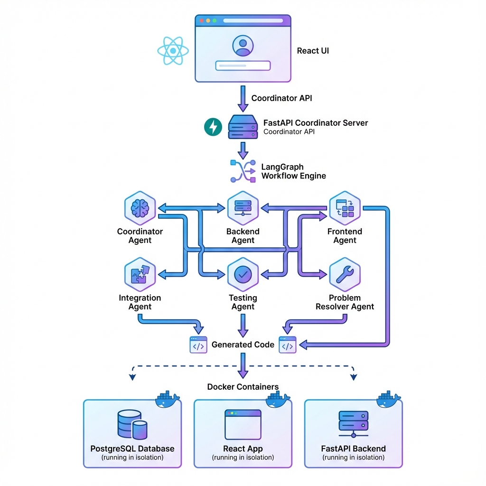
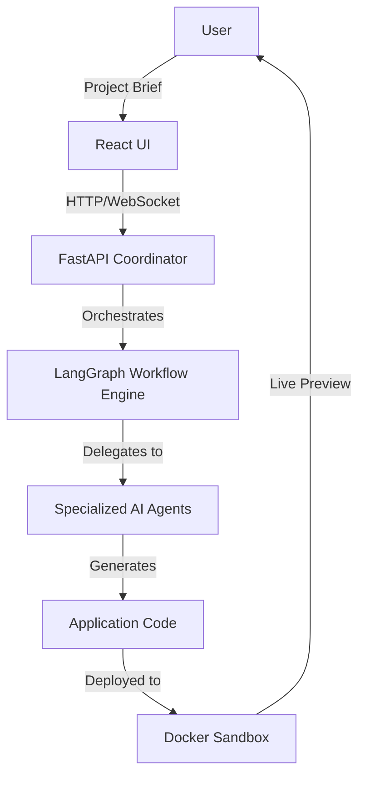
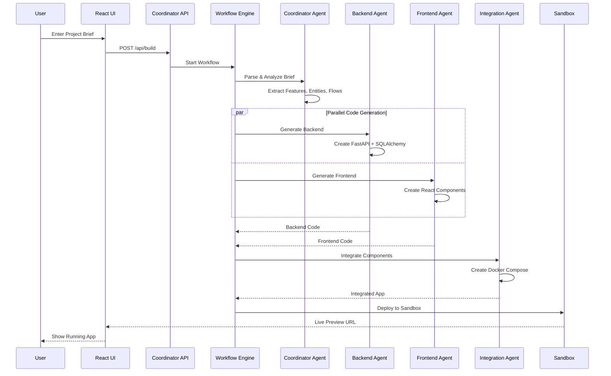
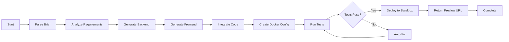
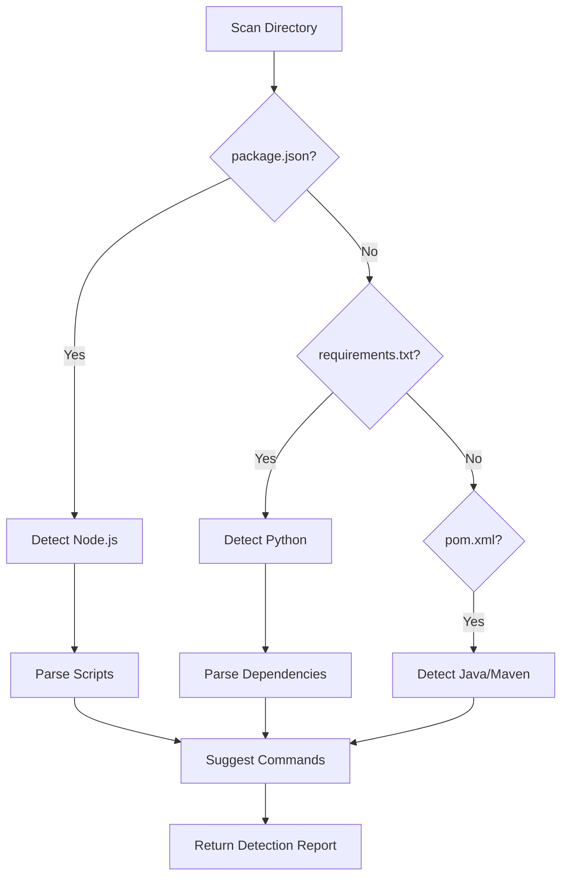
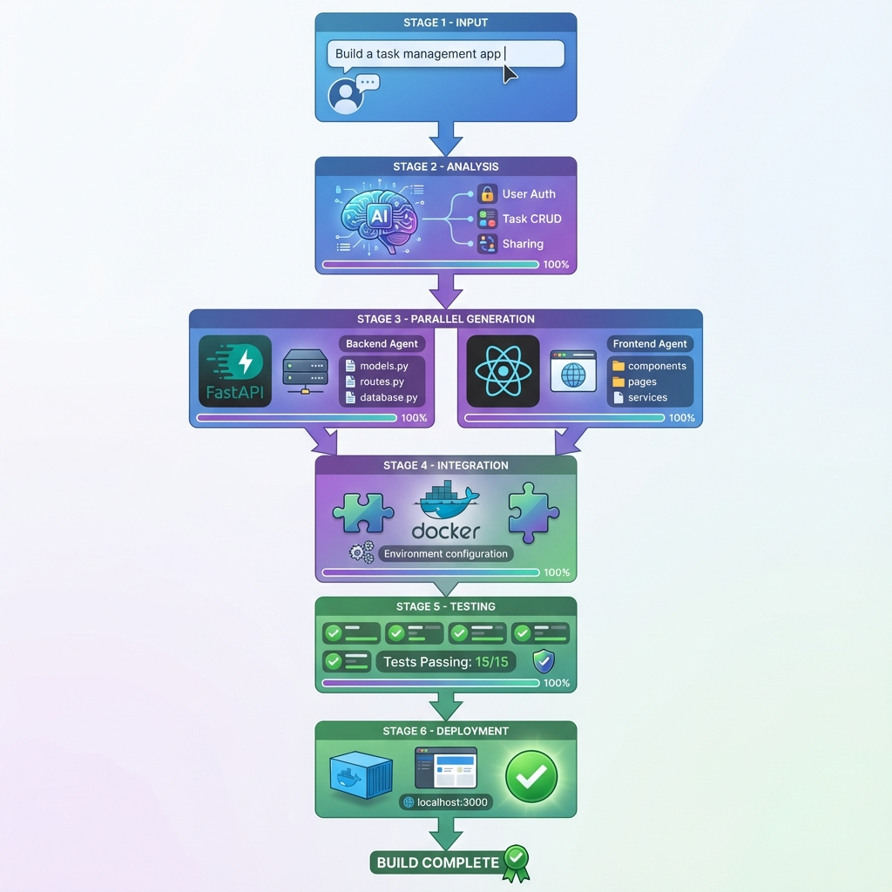

# Autonomous App-Building Platform - Complete Walkthrough

> **Last Updated**: 2025-12-30

A comprehensive guide to how the Autonomous App-Building Platform works, from architecture to execution flow.

---

## Table of Contents

1. [System Overview](#system-overview)
2. [Architecture Components](#architecture-components)
3. [Application Flow](#application-flow)
4. [Key Technologies](#key-technologies)
5. [Agent System](#agent-system)
6. [Workflow Engine](#workflow-engine)
7. [Sandbox & Execution](#sandbox--execution)
8. [API Endpoints](#api-endpoints)
9. [User Interface](#user-interface)
10. [Complete Build Lifecycle](#complete-build-lifecycle)

---

## System Overview

The **Autonomous App-Building Platform** is an AI-driven development system that transforms short project briefs into fully functional web applications using coordinated AI agents. The system orchestrates multiple specialized agents to handle different aspects of application development.

### High-Level Architecture



**Flow Diagram:**



### Core Capabilities

- **Natural Language Input**: Describe your app in plain English
- **Multi-Agent Orchestration**: Specialized agents for frontend, backend, testing, deployment
- **Code Generation**: Automated creation of React, FastAPI, database schemas
- **Sandbox Execution**: Isolated Docker containers for safe testing
- **Live Preview**: Real-time application preview with hot reload
- **Continuous Testing**: Automated test generation and execution
- **Error Resolution**: AI-powered problem detection and fixing

---

## Architecture Components

### 1. Entry Points

The system has two main entry points:

#### Main Entry Point ([main.py](file:///c:/Users/Lenovo/Code/Software%20builder/main.py))
- Simplified API for basic operations
- Serves as compatibility layer
- Delegates to coordinator for complex operations

#### Coordinator ([coordinator/main.py](file:///c:/Users/Lenovo/Code/Software%20builder/coordinator/main.py))
- Primary orchestration server (2865 lines)
- Comprehensive API with 50+ endpoints
- Advanced features: sandboxing, live preview, problem resolution
- Runs on port 5000 by default

### 2. Directory Structure

```
Software builder/
├── coordinator/              # Main orchestration layer
│   ├── agents/              # Coordinator-specific agents (10 agents)
│   ├── services/            # Core services (12 services)
│   ├── workflows/           # Workflow definitions (3 workflows)
│   ├── ui/                  # React-based web interface
│   └── main.py             # Main coordinator server
│
├── agents/                  # Specialized AI agents (23 agents)
│   ├── backend_agent.py    # FastAPI & SQLAlchemy generation
│   ├── frontend_agent.py   # React component generation
│   ├── integration_agent.py # System integration
│   ├── tester_agent.py     # Test generation & execution
│   ├── problem_resolver_agent.py  # Error detection
│   ├── enhanced_problem_resolver.py # Advanced fixing
│   ├── documentation_agent.py      # API docs generation
│   ├── security_agent.py           # Security analysis
│   ├── deployment_agent.py         # Docker & deployment
│   └── ...                        # 14+ other specialized agents
│
├── workflows/               # LangGraph workflows (7 workflows)
│   ├── app_builder_fixed.py        # Main workflow (331 lines)
│   ├── app_builder_enhanced.py     # Enhanced with templates
│   └── app_builder_phase2.py       # Advanced features
│
├── services/                # Shared services (26 services)
│   ├── framework_registry.py       # Framework selection
│   ├── template_library.py         # Code templates
│   ├── metrics_collector.py        # Performance tracking
│   ├── error_feedback_system.py    # Error analysis
│   └── ...
│
├── generated/               # Generated application output
│   └── [project-name]/
│       ├── backend/        # Generated FastAPI backend
│       ├── frontend/       # Generated React frontend
│       └── docker-compose.yml
│
├── config/                  # Configuration
│   └── settings.py         # System settings
│
└── main.py                 # Alternative entry point
```

---

## Application Flow

### Complete Request Flow



---

## Key Technologies

### AI & Orchestration

| Technology | Purpose | Usage |
|------------|---------|-------|
| **Google Gemini** | LLM for code generation | All agent reasoning & code generation |
| **LangGraph** | Workflow orchestration | State management, agent coordination |
| **LangChain** | LLM abstraction | Prompt management, chain execution |

### Backend Stack

| Technology | Purpose | Generated |
|------------|---------|-----------|
| **FastAPI** | Web framework | ✅ REST API endpoints |
| **SQLAlchemy** | ORM | ✅ Database models |
| **PostgreSQL** | Database | ✅ Schema & migrations |
| **Pydantic** | Validation | ✅ Request/response models |

### Frontend Stack

| Technology | Purpose | Generated |
|------------|---------|-----------|
| **React** | UI framework | ✅ Components |
| **Vite** | Build tool | ✅ Config |
| **TailwindCSS** | Styling | ✅ Utility classes |
| **React Router** | Navigation | ✅ Routes |

### Infrastructure

| Technology | Purpose | Features |
|------------|---------|----------|
| **Docker** | Containerization | Isolated sandboxes |
| **Docker Compose** | Multi-container | Frontend + Backend + DB |
| **Prometheus** | Metrics | Performance monitoring |

---

## Agent System

### Agent Hierarchy

The platform uses **23 specialized AI agents** organized in layers:

#### Layer 1: Coordinator
- **[CoordinatorAgent](file:///c:/Users/Lenovo/Code/Software%20builder/agents/coordinator_agent.py)** (12KB)
  - Accepts project briefs
  - Extracts features, entities, user flows
  - Delegates to specialized agents
  - Validates and integrates outputs

#### Layer 2: Code Generation
- **[BackendAgent](file:///c:/Users/Lenovo/Code/Software%20builder/agents/backend_agent.py)** (13KB)
  - Generates FastAPI REST endpoints
  - Creates SQLAlchemy models
  - Implements authentication & CRUD
  - Generates database migrations
  
- **[FrontendAgent](file:///c:/Users/Lenovo/Code/Software%20builder/agents/frontend_agent.py)** (12KB)
  - Generates React components
  - Creates views, navigation, forms
  - Implements API integration
  - Applies TailwindCSS styling

#### Layer 3: Integration & Quality
- **[IntegrationAgent](file:///c:/Users/Lenovo/Code/Software%20builder/agents/integration_agent.py)** (17KB)
  - Combines frontend and backend
  - Creates Docker Compose configuration
  - Sets up environment variables
  - Validates integration

- **[TesterAgent](file:///c:/Users/Lenovo/Code/Software%20builder/agents/tester_agent.py)** (23KB)
  - Generates unit tests
  - Generates integration tests
  - Runs pytest & Jest
  - Reports coverage

#### Layer 4: Problem Resolution
- **[ProblemResolverAgent](file:///c:/Users/Lenovo/Code/Software%20builder/agents/problem_resolver_agent.py)** (27KB)
  - Detects build errors
  - Analyzes stack traces
  - Suggests fixes
  
- **[EnhancedProblemResolver](file:///c:/Users/Lenovo/Code/Software%20builder/agents/enhanced_problem_resolver.py)** (38KB)
  - Auto-fixes common errors
  - Runs in diagnose-only or attempt-fix modes
  - Tracks fix success rate
  - Learns from past fixes

#### Layer 5: Advanced Features
- **[DocumentationAgent](file:///c:/Users/Lenovo/Code/Software%20builder/agents/documentation_agent.py)** (31KB)
  - Generates API documentation
  - Creates README files
  - Writes architecture docs

- **[SecurityAgent](file:///c:/Users/Lenovo/Code/Software%20builder/agents/security_agent.py)** (13KB)
  - Scans for vulnerabilities
  - Checks for SQL injection risks
  - Validates authentication flows

- **[DeploymentAgent](file:///c:/Users/Lenovo/Code/Software%20builder/agents/deployment_agent.py)** (13KB)
  - Creates Dockerfiles
  - Configures CI/CD pipelines
  - Prepares production deployment

### Agent Communication

Agents communicate via **structured JSON messages**:

```python
{
    "task_id": "uuid",
    "agent": "backend",
    "action": "generate_api",
    "inputs": {
        "entities": [...],
        "endpoints": [...]
    },
    "outputs": {
        "files": [...],
        "status": "success"
    }
}
```

---

## Workflow Engine

### Main Workflow: AppBuilderWorkflowFixed

The primary workflow ([app_builder_fixed.py](file:///c:/Users/Lenovo/Code/Software%20builder/workflows/app_builder_fixed.py)) orchestrates the entire build process:

#### Workflow State

```python
class AppBuilderState:
    build_id: str              # Unique build identifier
    brief: str                 # Original project description
    project_name: str          # Sanitized project name
    requirements: list[str]    # User requirements
    features: list[dict]       # Extracted features
    entities: list[dict]       # Data entities (User, Post, etc.)
    user_flows: list[dict]     # User interaction flows
    technical_specs: dict      # Technical specifications
    backend_code: dict         # Generated backend files
    frontend_code: dict        # Generated frontend files
    integrated_code: dict      # Combined codebase
    docker_config: dict        # Docker compose config
    test_results: dict         # Test execution results
    build_status: str          # success|failed|building
    logs: list[dict]           # Build logs
    current_step: str          # Current step name
    progress: int              # 0-100 percentage
    errors: list[str]          # Error messages
    app_url: str              # Preview URL
    source_path: str          # Local file path
```

#### Build Process Steps



### Workflow Methods

#### 1. Build from Brief

```python
async def build_from_brief(
    description: str,
    name: str = None,
    requirements: list[str] = None
) -> dict
```

**Steps:**
1. Generate unique `build_id`
2. Initialize state with brief and requirements
3. Create coordinator agent
4. Parse and analyze the brief → extract features, entities, flows
5. Generate technical specs
6. Parallel execution:
   - Backend agent generates FastAPI code
   - Frontend agent generates React code
7. Integration agent combines code
8. Create Docker Compose configuration
9. Persist metadata to `.project_metadata.json`
10. Return build result with preview URL

#### 2. Get Build Status

```python
async def get_build_status(build_id: str) -> dict
```

Returns current build progress, logs, and status.

#### 3. List Builds

```python
async def list_builds() -> list[dict]
```

Lists all builds with metadata from the build registry.

---

## Sandbox & Execution

### Sandbox Orchestrator

The [SandboxOrchestrator](file:///c:/Users/Lenovo/Code/Software%20builder/coordinator/services/sandbox_orchestrator.py) manages isolated Docker containers:

#### Features

- **Container Lifecycle**: Launch, monitor, stop containers
- **Resource Limits**: CPU, memory constraints
- **Network Isolation**: Dedicated Docker network
- **Session Management**: Time-based expiry
- **Health Monitoring**: Container health checks

#### Launch Flow

```python
# 1. User requests preview
POST /api/app/preview
{
    "app_path": "./generated/task-app",
    "port": 3000,
    "session_duration": 3600
}

# 2. System creates session
session = SessionManager.create_session(
    duration=3600,
    metadata={"app_path": "..."}
)

# 3. Launches Docker container
instance = SandboxOrchestrator.launch_instance(
    app_path=app_path,
    port=3000,
    cpu_limit=1.0,
    memory_limit="512m",
    timeout=3600
)

# 4. Returns preview URL
{
    "preview_url": "http://localhost:3000",
    "session_id": "abc-123",
    "expires_at": "2025-12-30T02:33:18Z"
}
```

### Repository Detector

The [RepositoryDetector](file:///c:/Users/Lenovo/Code/Software%20builder/coordinator/services/repository_detector.py) auto-detects project configuration:

#### Detection Process



**Detection Report:**
```json
{
    "languages": ["javascript", "python"],
    "frameworks": {
        "frontend": "react",
        "backend": "fastapi"
    },
    "commands": {
        "install": "npm install && pip install -r requirements.txt",
        "build": "npm run build",
        "test": "npm test && pytest",
        "run": "docker-compose up"
    },
    "ports": [3000, 8000],
    "environment": ["NODE_ENV", "DATABASE_URL"]
}
```

---

## API Endpoints

### Build Management

| Endpoint | Method | Description |
|----------|--------|-------------|
| `/api/build` | POST | Create new application from brief |
| `/api/build/{id}/status` | GET | Get build progress and status |
| `/api/builds` | GET | List all builds |
| `/api/build/{id}` | DELETE | Delete build and artifacts |

### Sandbox Operations

| Endpoint | Method | Description |
|----------|--------|-------------|
| `/api/app/preview` | POST | Create preview session |
| `/api/sandbox/launch` | POST | Launch Docker container |
| `/api/sandbox/{id}/stop` | POST | Stop running container |
| `/api/sandbox/instances` | GET | List active instances |

### Problem Resolution

| Endpoint | Method | Description |
|----------|--------|-------------|
| `/api/agent/problem-resolver` | POST | Start problem diagnosis/fix |
| `/api/agent/problem-resolver/{id}/result` | GET | Get resolution result |
| `/api/agent/problem-resolver/{id}/logs` | GET | Get resolution logs |

### Testing

| Endpoint | Method | Description |
|----------|--------|-------------|
| `/api/test/run` | POST | Run tests on project |
| `/api/test/history` | GET | Get test execution history |
| `/api/test/generate-suggestions` | POST | Generate test suggestions |

### Repository Detection

| Endpoint | Method | Description |
|----------|--------|-------------|
| `/api/repo/detect` | POST | Auto-detect repository config |
| `/api/repo/detect/latest` | GET | Get latest detection report |

### File System

| Endpoint | Method | Description |
|----------|--------|-------------|
| `/api/fs/list` | GET | List directory contents |
| `/api/fs/read` | GET | Read file contents |
| `/api/fs/write` | POST | Write file contents |
| `/api/fs/delete` | DELETE | Delete file/directory |

### Monitoring

| Endpoint | Method | Description |
|----------|--------|-------------|
| `/metrics` | GET | Prometheus metrics |
| `/api/metrics/dashboard` | GET | Build metrics dashboard |
| `/health` | GET | Health check |

---

## User Interface

### React UI

The coordinator serves a React-based UI from [coordinator/ui/dist](file:///c:/Users/Lenovo/Code/Software%20builder/coordinator/ui/dist):

#### Key Features

1. **Build Dashboard**
   - Create new builds from project briefs
   - Monitor build progress in real-time
   - View build logs and errors
   - Access live preview links

2. **Project Explorer**
   - Browse generated projects
   - View file structure
   - Edit source code
   - Manage environment variables

3. **Sandbox Console**
   - Launch sandboxed instances
   - View container logs
   - Monitor resource usage
   - Execute commands

4. **Testing Panel**
   - Run test suites
   - View test results
   - Generate new tests
   - Coverage reports

5. **Problem Resolver**
   - Diagnose build errors
   - Apply auto-fixes
   - Review fix attempts
   - Track success rate

### WebSocket Updates

Real-time build updates via WebSocket:

```javascript
const ws = new WebSocket(`ws://localhost:5000/ws/build/${buildId}`);

ws.onmessage = (event) => {
    const status = JSON.parse(event.data);
    // status: { build_id, status, progress, current_step, logs }
    updateUI(status);
};
```

---

## Complete Build Lifecycle

### Visual Overview



### Example: Task Management App

Let's walk through a complete build from start to finish:

#### 1. User Submits Brief

```
POST /api/build
{
    "description": "Build a task management app with user authentication and task sharing",
    "name": "task-tracker",
    "requirements": [
        "User registration and login",
        "Create, edit, delete tasks",
        "Mark tasks as complete",
        "Share tasks with other users",
        "Email notifications"
    ]
}
```

#### 2. Coordinator Agent Analyzes

**Extracted Features:**
- User authentication (register, login, logout)
- Task CRUD operations
- Task status management
- Task sharing
- Email notifications

**Identified Entities:**
```python
[
    {
        "name": "User",
        "fields": {
            "id": "uuid",
            "email": "string",
            "password_hash": "string",
            "created_at": "datetime"
        }
    },
    {
        "name": "Task",
        "fields": {
            "id": "uuid",
            "title": "string",
            "description": "text",
            "completed": "boolean",
            "owner_id": "uuid",
            "created_at": "datetime"
        }
    },
    {
        "name": "TaskShare",
        "fields": {
            "id": "uuid",
            "task_id": "uuid",
            "shared_with_user_id": "uuid"
        }
    }
]
```

#### 3. Backend Agent Generates Code

**Generated Files:**
```
generated/task-tracker/backend/
├── app/
│   ├── main.py                  # FastAPI app
│   ├── models/
│   │   ├── user.py             # User model
│   │   ├── task.py             # Task model
│   │   └── task_share.py       # TaskShare model
│   ├── routers/
│   │   ├── auth.py             # /api/auth endpoints
│   │   ├── tasks.py            # /api/tasks endpoints
│   │   └── shares.py           # /api/shares endpoints
│   ├── schemas/
│   │   ├── user.py             # Pydantic schemas
│   │   └── task.py
│   ├── database.py             # DB connection
│   └── auth.py                 # JWT authentication
├── requirements.txt
└── Dockerfile
```

**Sample Endpoint (app/routers/tasks.py):**
```python
@router.post("/", response_model=TaskResponse)
async def create_task(
    task: TaskCreate,
    db: Session = Depends(get_db),
    current_user: User = Depends(get_current_user)
):
    db_task = Task(
        title=task.title,
        description=task.description,
        owner_id=current_user.id
    )
    db.add(db_task)
    db.commit()
    return db_task
```

#### 4. Frontend Agent Generates Code

**Generated Files:**
```
generated/task-tracker/frontend/
├── src/
│   ├── components/
│   │   ├── TaskList.jsx        # List of tasks
│   │   ├── TaskItem.jsx        # Individual task
│   │   ├── TaskForm.jsx        # Create/edit form
│   │   ├── LoginForm.jsx       # Login
│   │   └── RegisterForm.jsx    # Registration
│   ├── pages/
│   │   ├── Dashboard.jsx       # Main dashboard
│   │   ├── Login.jsx
│   │   └── Register.jsx
│   ├── services/
│   │   └── api.js              # API client
│   ├── App.jsx
│   └── main.jsx
├── package.json
├── vite.config.js
└── tailwind.config.js
```

**Sample Component (components/TaskItem.jsx):**
```jsx
export function TaskItem({ task, onToggle, onDelete }) {
    return (
        <div className="bg-white shadow rounded-lg p-4">
            <div className="flex items-center justify-between">
                <h3 className={task.completed ? "line-through" : ""}>
                    {task.title}
                </h3>
                <button
                    onClick={() => onToggle(task.id)}
                    className="bg-blue-500 text-white px-3 py-1 rounded"
                >
                    {task.completed ? "Undo" : "Complete"}
                </button>
            </div>
        </div>
    );
}
```

#### 5. Integration Agent Combines

**docker-compose.yml:**
```yaml
version: '3.8'
services:
  backend:
    build: ./backend
    ports:
      - "8000:8000"
    environment:
      - DATABASE_URL=postgresql://user:pass@db:5432/taskdb
      - JWT_SECRET=generated-secret
    depends_on:
      - db

  frontend:
    build: ./frontend
    ports:
      - "3000:3000"
    environment:
      - VITE_API_URL=http://localhost:8000

  db:
    image: postgres:15
    environment:
      - POSTGRES_DB=taskdb
      - POSTGRES_USER=user
      - POSTGRES_PASSWORD=pass
    volumes:
      - postgres_data:/var/lib/postgresql/data

volumes:
  postgres_data:
```

#### 6. Tests Generated

**Backend Tests (test_tasks.py):**
```python
def test_create_task(client, auth_token):
    response = client.post(
        "/api/tasks/",
        headers={"Authorization": f"Bearer {auth_token}"},
        json={"title": "Test Task", "description": "Test"}
    )
    assert response.status_code == 200
    assert response.json()["title"] == "Test Task"
```

**Frontend Tests (TaskItem.test.jsx):**
```jsx
test('renders task title', () => {
    const task = { id: 1, title: "Test Task", completed: false };
    render(<TaskItem task={task} onToggle={jest.fn()} />);
    expect(screen.getByText("Test Task")).toBeInTheDocument();
});
```

#### 7. Deployment to Sandbox

```bash
# System runs automatically:
docker-compose up -d

# Checks health:
curl http://localhost:8000/health  # Backend
curl http://localhost:3000         # Frontend

# Returns preview URL
```

#### 8. Build Result

```json
{
    "status": "success",
    "build_id": "abc-123-def-456",
    "message": "Application built successfully",
    "app_url": "http://localhost:3000",
    "source_path": "./generated/task-tracker",
    "logs": [
        {"level": "info", "message": "Brief analyzed", "timestamp": "..."},
        {"level": "info", "message": "Backend generated", "timestamp": "..."},
        {"level": "info", "message": "Frontend generated", "timestamp": "..."},
        {"level": "success", "message": "Build complete", "timestamp": "..."}
    ]
}
```

---

## Advanced Features

### 1. Live Preview Bridge

The [LivePreviewBridge](file:///c:/Users/Lenovo/Code/Software%20builder/coordinator/services/agent_collaboration_manager.py) enables hot-reload during development:

- Watches file changes
- Rebuilds containers on update
- Maintains WebSocket connection
- Notifies frontend of changes

### 2. Error Feedback System

The [ErrorFeedbackSystem](file:///c:/Users/Lenovo/Code/Software%20builder/services/error_feedback_system.py) learns from mistakes:

- Stores error patterns
- Suggests fixes based on history
- Tracks fix success rates
- Improves over time

### 3. Framework Registry

The [FrameworkRegistry](file:///c:/Users/Lenovo/Code/Software%20builder/services/framework_registry.py) supports multiple frameworks:

**Backend Options:**
- FastAPI (default)
- Flask
- Django
- Express.js

**Frontend Options:**
- React + Vite (default)
- Next.js
- Vue.js
- Svelte

### 4. Template Library

The [TemplateLibrary](file:///c:/Users/Lenovo/Code/Software%20builder/services/template_library.py) provides pre-built patterns:

- Authentication flows
- CRUD operations
- Payment integration
- Email services
- File uploads

### 5. Metrics & Monitoring

**Prometheus Metrics:**
- Build success/failure rates
- Agent execution times
- API request latency
- Active sandbox instances
- Error frequency

**Dashboard Widgets:**
- Build history chart
- Resource utilization
- Test coverage trends
- Agent performance

---

## Configuration

### Environment Variables

```bash
# API Keys
GOOGLE_API_KEY=your-gemini-api-key

# Model Selection
GEMINI_MODEL=gemini-1.5-pro

# Paths
GENERATED_APPS_DIR=./generated
ARTIFACTS_DIR=./.sb_artifacts

# Docker
DOCKER_NETWORK=appbuilder-network

# Rate Limiting
RATE_LIMIT_BUILD=10/minute
RATE_LIMIT_PREVIEW=20/minute

# CORS
CORS_ALLOW_ORIGINS=["http://localhost:3000"]

# Features
USE_FAKE_WORKFLOW=false
DEBUG=false
```

---

## Running the Application

### Quick Start

```bash
# 1. Install dependencies
pip install -r requirements.txt

# 2. Set up environment
cp .env.example .env
# Add your GOOGLE_API_KEY to .env

# 3. Run coordinator
python coordinator/main.py

# 4. Access UI
# Coordinator UI: http://localhost:5000/ui
# API Docs: http://localhost:5000/docs
```

### Using Docker Compose

```bash
# Full stack deployment
docker-compose up

# Access services:
# - Coordinator: http://localhost:5000
# - Generated Apps: As assigned (3000+)
```

### Testing

```bash
# Unit tests
pytest -q

# Full end-to-end tests
python comprehensive_test.py

# Windows test script
powershell -ExecutionPolicy Bypass -File scripts/run_all_tests.ps1 -E2E
```

---

## Summary

The Autonomous App-Building Platform is a sophisticated multi-agent system that:

1. **Accepts** natural language project briefs
2. **Analyzes** requirements using AI
3. **Generates** full-stack applications (React + FastAPI + PostgreSQL)
4. **Tests** code automatically
5. **Deploys** to isolated Docker sandboxes
6. **Monitors** and auto-fixes errors
7. **Provides** live preview with hot-reload

**Key Strengths:**
- ✅ End-to-end automation
- ✅ Multi-framework support
- ✅ Isolated sandbox execution
- ✅ AI-powered error resolution
- ✅ Real-time monitoring
- ✅ Production-ready code generation

**Use Cases:**
- Rapid prototyping
- MVP development
- Code learning
- Architecture exploration
- Template generation

---

## Next Steps

To explore further:

1. **Try a Build**: Submit a project brief via `/api/build`
2. **Explore Agents**: Review agent implementations in `agents/`
3. **Customize Workflows**: Modify `workflows/app_builder_fixed.py`
4. **Add Templates**: Extend `services/template_library.py`
5. **Monitor Metrics**: Access Prometheus at `/metrics`

For questions or issues, refer to the [documentation](file:///c:/Users/Lenovo/Code/Software%20builder/docs) or examine the [comprehensive tests](file:///c:/Users/Lenovo/Code/Software%20builder/comprehensive_test.py).
