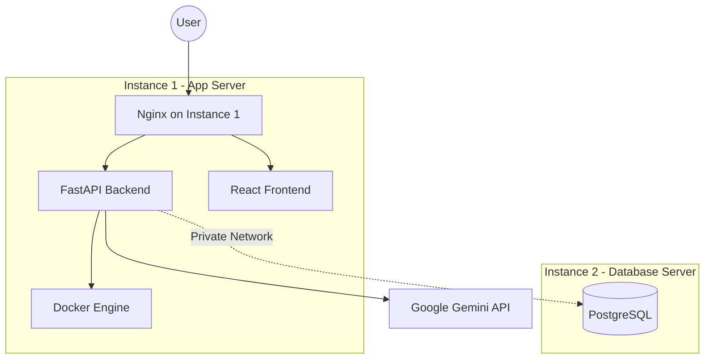

# Oracle Cloud Hybrid Deployment (2x AMD Instances)

This guide helps you deploy using **2 AMD E2.1.Micro instances** (free tier) when ARM A1 capacity is unavailable.

---

## Architecture Overview



**Instance 1 (App)**: Backend + Frontend + Docker (1 OCPU, 1GB RAM)  
**Instance 2 (Database)**: PostgreSQL only (1 OCPU, 1GB RAM)

---

## Part 1: Create Two Instances

### Instance 1: Application Server

1. **☰ Menu** → **Compute** → **Instances** → **Create instance**

2. **Name**: `sb-app-server`

3. **Image and Shape**:
   - Click **"Change shape"**
   - Select **"Specialty and previous generation"**
   - Choose **"VM.Standard.E2.1.Micro"** (Always Free)
   - Image: **"Canonical Ubuntu 22.04 Minimal"** (x86_64)

4. **Networking**:
   - VCN: Select your existing `sb-vcn`
   - Subnet: **"Public Subnet-sb-vcn"**
   - ✅ **Assign public IPv4 address**

5. **SSH Keys**: Generate and save as `app-server-key.key`

6. Click **"Create"**

### Instance 2: Database Server

1. Create another instance with:
   - **Name**: `sb-db-server`
   - **Shape**: VM.Standard.E2.1.Micro
   - **Image**: Canonical Ubuntu 22.04 Minimal
   - **Networking**: Same VCN (`sb-vcn`), **Public Subnet**
   - **SSH Keys**: Generate and save as `db-server-key.key`

2. **Note both public IP addresses**:
   - App Server IP: `___.___.___.___ `
   - DB Server IP: `___.___.___.___ `

---

## Part 2: Configure Firewall Rules

### Update Security List

1. Go to your VCN → **Security Lists** → Default security list

2. **Add Ingress Rules**:

| Source CIDR | Protocol | Port | Description |
|-------------|----------|------|-------------|
| `0.0.0.0/0` | TCP | 80 | HTTP |
| `0.0.0.0/0` | TCP | 443 | HTTPS |
| `0.0.0.0/0` | TCP | 5000 | Backend API |
| `10.0.0.0/24` | TCP | 5432 | PostgreSQL (internal only) |

---

## Part 3: Setup Database Server

### Connect to DB Server

```bash
ssh -i db-server-key.key ubuntu@DB_SERVER_IP
```

### Install PostgreSQL

```bash
# Update system
sudo apt update && sudo apt upgrade -y

# Install PostgreSQL
sudo apt install -y postgresql postgresql-contrib

# Start and enable
sudo systemctl start postgresql
sudo systemctl enable postgresql
```

### Configure PostgreSQL

```bash
# Switch to postgres user
sudo -u postgres psql

# Run these SQL commands:
CREATE DATABASE appbuilder;
CREATE USER softwarebuilder WITH PASSWORD 'YOUR_STRONG_PASSWORD';
GRANT ALL PRIVILEGES ON DATABASE appbuilder TO softwarebuilder;
\q
```

### Allow Remote Connections

```bash
# Edit postgresql.conf
sudo nano /etc/postgresql/14/main/postgresql.conf
```

Find and change:
```
listen_addresses = '*'
```

```bash
# Edit pg_hba.conf
sudo nano /etc/postgresql/14/main/pg_hba.conf
```

Add this line at the end:
```
host    appbuilder    softwarebuilder    10.0.0.0/24    md5
```

```bash
# Restart PostgreSQL
sudo systemctl restart postgresql
```

**Get the private IP** of this instance:
```bash
hostname -I
# Note the 10.0.0.x address
```

---

## Part 4: Setup Application Server

### Connect to App Server

```bash
ssh -i app-server-key.key ubuntu@APP_SERVER_IP
```

### Run Setup Script

```bash
# Clone repository
git clone https://github.com/YOUR_USERNAME/Software-builder.git /opt/software-builder
cd /opt/software-builder/deploy

# Make setup script executable
chmod +x oracle-setup-hybrid.sh

# Run setup
./oracle-setup-hybrid.sh
```

### Configure Environment

```bash
cd /opt/software-builder
cp deploy/.env.production.template .env
nano .env
```

Update these values:
```env
GOOGLE_API_KEY=your_gemini_api_key
POSTGRES_PASSWORD=YOUR_STRONG_PASSWORD
DATABASE_URL=postgresql://softwarebuilder:YOUR_STRONG_PASSWORD@DB_PRIVATE_IP:5432/appbuilder
```

Replace `DB_PRIVATE_IP` with the 10.0.0.x address from the database server.

### Build Frontend

```bash
cd coordinator/ui
npm install
npm run build
cd ../..
```

### Start Services (Without PostgreSQL)

```bash
# Use the hybrid docker-compose
docker-compose -f deploy/docker-compose.hybrid.yml up -d
```

---

## Part 5: Configure Nginx

```bash
sudo cp deploy/nginx.conf /etc/nginx/sites-available/software-builder
sudo nano /etc/nginx/sites-available/software-builder
```

Replace `YOUR_DOMAIN_OR_IP` with your app server's public IP.

```bash
sudo ln -s /etc/nginx/sites-available/software-builder /etc/nginx/sites-enabled/
sudo rm /etc/nginx/sites-enabled/default
sudo nginx -t
sudo systemctl reload nginx
```

---

## Access Your Application

- **Frontend**: `http://APP_SERVER_IP`
- **Backend API**: `http://APP_SERVER_IP/api`
- **Health Check**: `http://APP_SERVER_IP/health`

---

## Performance Considerations

### With 1GB RAM per instance:

✅ **Will Work**:
- Code generation (uses Gemini API, not local resources)
- Build management
- File operations
- Basic sandbox operations

⚠️ **May Be Limited**:
- Multiple concurrent builds
- Large sandbox containers
- Heavy Docker operations

### Optimization Tips:

1. **Reduce Docker memory**:
   ```bash
   # In docker-compose.hybrid.yml, add memory limits
   mem_limit: 512m
   ```

2. **Add swap space**:
   ```bash
   sudo fallocate -l 2G /swapfile
   sudo chmod 600 /swapfile
   sudo mkswap /swapfile
   sudo swapon /swapfile
   echo '/swapfile none swap sw 0 0' | sudo tee -a /etc/fstab
   ```

3. **Monitor resources**:
   ```bash
   htop  # Install with: sudo apt install htop
   ```

---

## Upgrade Path

When ARM A1 capacity becomes available:

1. Create ARM A1 instance (4 OCPU, 24GB RAM)
2. Backup database: `pg_dump` from DB server
3. Deploy everything on single ARM instance
4. Restore database
5. Terminate the 2 AMD instances

---

## Troubleshooting

### Out of Memory?
```bash
# Check memory
free -h

# Add more swap
sudo fallocate -l 4G /swapfile2
sudo chmod 600 /swapfile2
sudo mkswap /swapfile2
sudo swapon /swapfile2
```

### Can't connect to database?
```bash
# From app server, test connection
psql -h DB_PRIVATE_IP -U softwarebuilder -d appbuilder
```

### Services won't start?
```bash
# Check logs
docker-compose -f deploy/docker-compose.hybrid.yml logs
```


private ip :- 10.0.0.195 